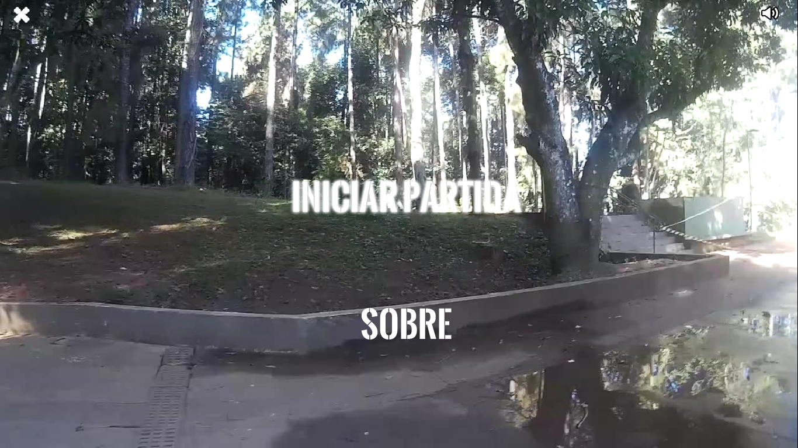
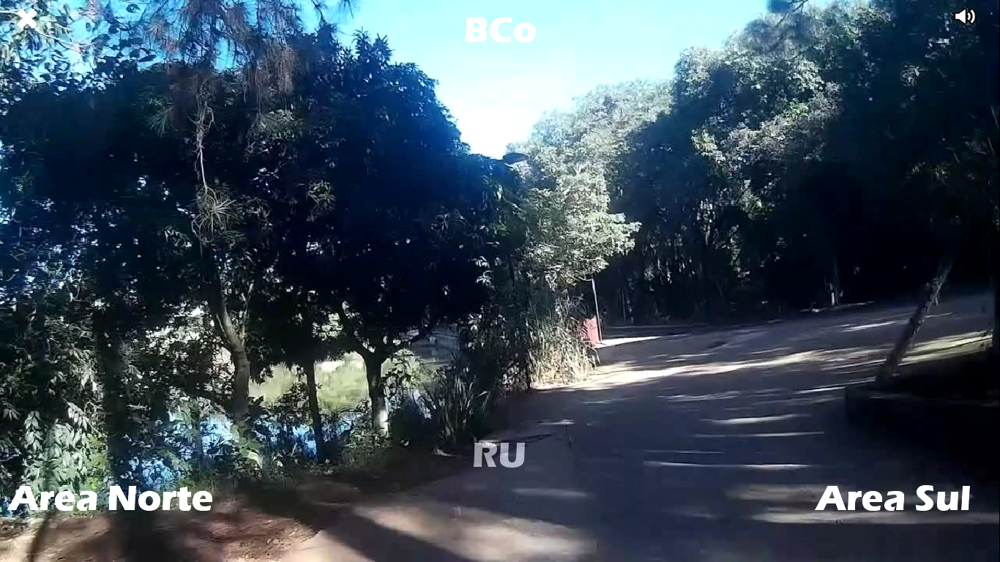

# UFSCar Summer Tour




## Project

- It was developed as a partial grade to the Data Structure class, Computer Science at UFSCar;
- It was the third one of 3 games;
- It's a Binary Tree application (play the game and try to find it!);
- It participated of the [ED Games](http://edgames.dc.ufscar.br/) competition;
- It was indicated to the category "Tree Application" at [ED Games 2015](http://edgames.dc.ufscar.br/games2015.htm).

- It's a nice way to **take a walk around** UFSCar, campus São Carlos.

## Authors
- Antonio Carlos Falcão Petri
- José Antônio dos Santos Júnior
- José Vitor de Carvalho Aquino
- Tiago Bonadio Badoco

All of them are Computer Science students at [UFSCar, São Carlos](http://ufscar.br/).

## Allegro

"Allegro 4 and Allegro 5 are cross-platform, libraries mainly aimed at video game and multimedia programming. They handle common, low-level tasks such as creating windows, accepting user input, loading data, drawing images, playing sounds, etc. and generally abstracting away the underlying platform. However, Allegro is not a game engine: you are free to design and structure your program as you like.", [Allegro's Introduction page](http://liballeg.org/readme.html).

## Allegro 5.2

On this game, we will need Allegro 5.2. It adds an Allegro Addon for Video Streaming. When this game was build, we used an alpha version of Allegro 5.1, so we cannot guarantee that everything will run all right.

## Compiling

We will need to install [Allegro 5.2](http://liballeg.org/) and it's addons. Consult a search engine to see if it's available at your distribution repository.

Maybe you will need to compile Allegro yourself. If so, download it [here](http://liballeg.org/download.html).

Unzip it on a folder called `allegro` under the same parent folder of this projetct. It will look something like:

\- games/

---- allegro/

---- ufscarSummerTour/

Follow the instructions on `README_make.txt`. It's pretty straightforward.

Now, compile this project with `make`:

`$ make`

### Playing
If you didn't install allegro on your PATH, you can do so temporarily with (adjust the path if needed):
`$ export LD_LIBRARY_PATH=$LD_LIBRARY_PATH:../../allegro/build/lib`

This line expects that you are at this project's `bin` folder. If so, run:

```shell
$ ./Tour
```

## Repo Goals

The semester is over (for a little while, by now) and we won't be trying to improve this game.

Developing a game with a low level library (without all the game engine's magic), trying to build up a Software/Game Architecture, and using our recently learned Data Structures knowledge  formed a really great experience though.

So, this repository just aims to share our game and its source code. Hopefully, it will be helpful for someone, maybe some Data Structure student.

If you've got any questions, suggestions or comments, we will gladly help you.

## TODO

- [x] README
- [x] Convert documentation
- [ ] Comments
- [x] How to manage the ~600MB of video?
    - ~~Tmp fix: some cloud-based storage service. Get in touch with us if you need them.~~
    - Use Git LFS and [GitHub's LFS quota](https://docs.github.com/en/billing/managing-billing-for-git-large-file-storage/about-billing-for-git-large-file-storage) to version files in a separate, private repo [UFSCar Summer Tour - Data Assets](https://github.com/falcaopetri/ufscar-summer-tour-data).
